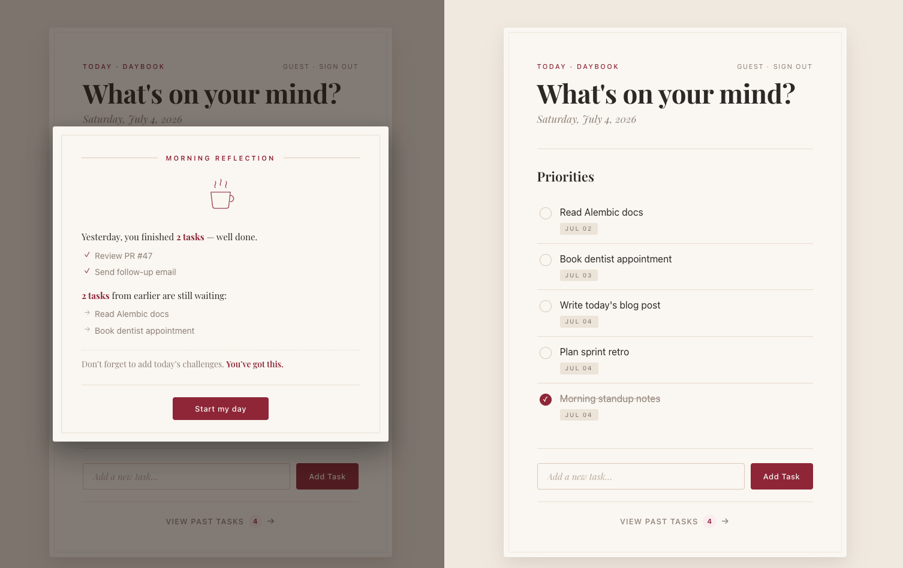

# Daybook

A quieter Flask journal for daily tasks and morning reflections.

**Live demo →** [daybook-qti8.onrender.com](https://daybook-qti8.onrender.com/)
Click **"Try as guest →"** on the sign-in page for one-click access with a
curated set of sample tasks. No registration required.

> Deployed on Render's free tier — the first request after ~15 minutes of
> idle takes about 30 seconds to wake up. Subsequent requests are instant.



---

## What it does

- **Capture** what's on your mind — one small task at a time.
- On your first visit each day, a **Morning Reflection** modal recaps
  yesterday's completions and surfaces anything you didn't finish.
- Older completed tasks slide into a **quiet archive**, grouped by
  date, so today's list stays focused on today.
- **Guest mode** reseeds a full sample dataset on every visit — great
  for demoing without leaving artifacts.

## Tech stack

| Layer | Choice |
|---|---|
| Language | Python 3.11+ |
| Web framework | Flask 3 + Jinja2 |
| ORM & migrations | SQLAlchemy 2 + Alembic (via Flask-Migrate) |
| Auth | Flask-Login + Werkzeug password hashing |
| CSRF | Flask-WTF |
| Database | Postgres in production (Neon), SQLite locally |
| Server | Gunicorn on Render |
| Frontend | Vanilla HTML/CSS, no build step, no framework |

---

## A few things I paid attention to

### Auth and access control

- **Password hashing** via `werkzeug.security` — passwords are never
  stored in plaintext.
- **CSRF tokens** on every state-changing route (via Flask-WTF).
- **Data isolation between users**: every task query filters by the
  current user's id, so someone signed in as one account can't reach
  another account's data by guessing task ids.
- **Session cookies** are marked `HttpOnly` and `SameSite=Lax`, and
  `Secure` in production.

### Schema and migrations

- Schema changes go through **Alembic migrations** rather than
  `db.create_all()`, so every change is versioned.
- The **same code runs SQLite locally and Postgres in production** —
  the database URL comes from an environment variable.

### Deployment

- All secrets (database URL, session key, port) come from environment
  variables. No secrets in the repo.
- Every deploy runs pending migrations before starting the server,
  so schema changes ship together with the code that needs them.

### UX

- **Everything works with JavaScript disabled** — forms POST to real
  endpoints. JS is layered on top only to smooth modal animations.
- **Respects `prefers-reduced-motion`** for users who don't want
  animations.
- **Guest mode reseeds** a curated sample dataset on every login, so
  demo visitors always see the app in all its states (archive,
  carryovers, yesterday's wins) without adding data themselves.

---

## Running locally

```bash
git clone https://github.com/indoortigeryue/daybook.git
cd daybook

python3 -m venv env
source env/bin/activate            # Windows: env\Scripts\activate

pip install -r requirements.txt

export FLASK_APP=app.py
flask db upgrade                   # Creates the SQLite database

python app.py
```

Open <http://127.0.0.1:5001> — register a new account, or click
**Try as guest →** for one-click access.

## Project layout

```
daybook/
├── app.py                  # Models + all routes in a single file
├── migrations/             # Alembic schema history
├── templates/              # Jinja2 templates
│   ├── base.html
│   ├── index.html          # Main task list + Morning Reflection + Welcome
│   ├── archive.html        # Past-completed tasks, grouped by day
│   ├── login.html
│   ├── register.html
│   └── update.html
├── static/css/main.css     # All styles
├── requirements.txt
└── Procfile                # web: gunicorn app:app
```

## Ideas for future extensions

- Email + password reset flow
- Per-user timezones (currently the server stores and displays UTC)
- Task tags and search
- Share links for daily reflections
- Native mobile-friendly PWA install